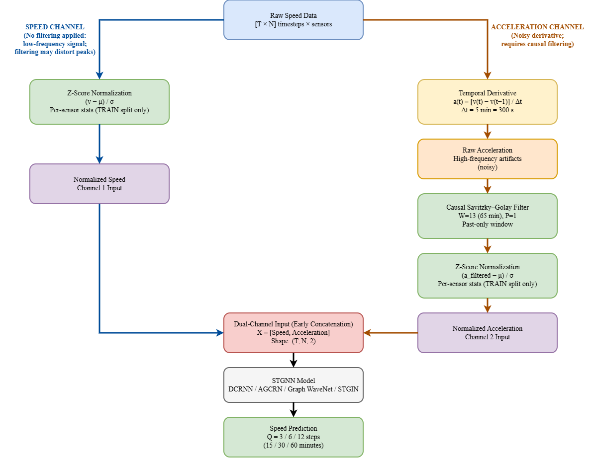

# AccelTraffic: Acceleration-Enriched Input Preprocessing for Traffic Speed Forecasting

[](https://www.python.org/downloads/)
[](https://pytorch.org/)
[](LICENSE)

Reference implementation for **"Acceleration-Enriched Input Preprocessing for
Traffic Speed Forecasting: A Dual-Channel Framework"** (IEEE Transactions on
Intelligent Transportation Systems, 2026).



## Overview

This repository provides an **architecture-agnostic, input-level preprocessing
framework** that adds acceleration as a causally filtered auxiliary channel with
dual-channel normalization for traffic speed forecasting. The framework requires
no architectural modification and is evaluated on **five** spatiotemporal
backbones spanning recurrent, adaptive-graph, convolutional, graph-attention, and
transformer paradigms:

- **DCRNN** — Diffusion Convolutional Recurrent Neural Network (Li et al., ICLR 2018)
- **AGCRN** — Adaptive Graph Convolutional Recurrent Network (Bai et al., NeurIPS 2020)
- **Graph WaveNet** — Graph WaveNet for Deep Spatial-Temporal Modeling (Wu et al., IJCAI 2019)
- **STGIN** — Spatio-Temporal Generative Inference Network (Zou et al., 2023)
- **STAEformer** — Spatio-Temporal Adaptive Embedding Transformer (Liu et al., CIKM 2023)

## Key contributions

1. **Acceleration-aware preprocessing** — derives acceleration from speed and uses it as an auxiliary input channel (the prediction target is speed only).
2. **Strictly causal Savitzky–Golay filtering** — data-driven parameter selection (W=13, p=1) using only past/present samples (no future leakage).
3. **Per-sensor dual-channel normalization** — independent z-score statistics for the speed and acceleration channels (train-only).
4. **Architecture-agnostic validation** — consistent MAE improvements across all five backbones on METR-LA and PEMS-BAY (90 experiments).
5. **Statistical significance** — Diebold–Mariano tests (all 60 paired comparisons significant at p < 0.001).
6. **Traffic-science grounding** — comparison against a CTM/LWR physical baseline, a per-regime breakdown, and a mutual-information / Granger-causality analysis.

## Results summary (Q=12, 60-min horizon, MAE in mph)

### METR-LA
| Model | NoAcc (baseline) | Acc_SG (proposed) | Improvement |
| ----- | ---------------- | ----------------- | ----------- |
| AGCRN | 5.05 | 4.27 | −15.4% |
| DCRNN | 5.31 | 4.44 | −16.4% |
| GWNET | 4.66 | 4.27 | −8.4% |
| STGIN | 5.48 | 4.95 | −9.7% |
| STAEformer | 5.46 | 4.95 | −9.3% |

### PEMS-BAY
| Model | NoAcc (baseline) | Acc_SG (proposed) | Improvement |
| ----- | ---------------- | ----------------- | ----------- |
| AGCRN | 1.78 | 1.64 | −7.9% |
| DCRNN | 1.91 | 1.75 | −8.4% |
| GWNET | 1.84 | 1.69 | −8.2% |
| STGIN | 2.22 | 1.94 | −12.6% |
| STAEformer | 2.28 | 2.05 | −10.1% |

The full set of 90 experiments (5 models × 2 datasets × 3 horizons × 3 configs)
and all paper tables are provided in `results/` (see below).

## Repository structure

```
AccelTraffic/
├── models/                       # Five model architectures
│   ├── dcrnn_model.py
│   ├── agcrn_model.py
│   ├── gwnet_model.py
│   ├── stgin_model.py            # + bridge_trans / st_block / gat / gcn / temporal_attention
│   ├── staeformer_model.py
│   └── model_factory.py
├── preprocessing/                # Acceleration derivation, SG filtering, data loaders
│   ├── generate_acceleration.py
│   ├── sg_parameter_search.py
│   ├── simple_data_loading.py    # DCRNN / GWNET / AGCRN / STAEformer
│   └── stgin_data_loading.py     # STGIN (with STE embeddings)
├── analysis/                     # Reproduce the paper's analyses (see analysis/README.md)
│   ├── diebold_mariano_test.py   # Table VI
│   ├── regime_breakdown.py       # Table IV
│   ├── ctm_baseline.py           # Table III
│   ├── mutual_information.py     # Fig. 6 (MI + Granger)
│   ├── granger_causality.py      # Fig. 6B (all sensors)
│   ├── computational_overhead.py
│   └── ablation_summary.py       # Table VII
├── results/                      # Paper tables as CSV
│   ├── main_results.csv          # Table II  (90 rows)
│   ├── ctm_baseline.csv          # Table III
│   ├── regime_breakdown.csv      # Table IV
│   ├── horizon_selection.csv     # Table V
│   ├── diebold_mariano.csv       # Table VI
│   ├── component_ablations.csv   # Table VII
│   └── sg_sensitivity.csv        # Table VIII
├── figures/                      # Publication figures
├── utils/                        # Metrics, optimizers, helpers
├── data/                         # Data files (download required) + normalization params
├── train_multimodel.py           # Train DCRNN, AGCRN, GWNET, STAEformer
├── train_stgin.py                # Train STGIN
├── SETUP.md
├── LICENSE                       # MIT
└── README.md
```

## Installation

```bash
git clone https://github.com/omarsaud/AccelTraffic.git
cd AccelTraffic
pip install -r requirements.txt
```

Requires Python ≥ 3.8 and PyTorch ≥ 2.0 (plus NumPy, Pandas, SciPy, scikit-learn,
h5py). See [`SETUP.md`](SETUP.md) for a step-by-step guide.

## Datasets

Two standard benchmarks from the [DCRNN repository](https://github.com/liyaguang/DCRNN):

| Dataset  | Sensors | Timesteps | Mean speed | Std. speed |
| -------- | ------- | --------- | ---------- | ---------- |
| METR-LA  | 207     | 34,272    | 54.4 mph   | 18.4 mph   |
| PEMS-BAY | 325     | 52,116    | 62.7 mph   | 8.4 mph    |

(Statistics are per-sensor z-score, computed on the training split only, matching
the paper.) Both use a 70/10/20 chronological train/validation/test split.

### Data download

The raw benchmarks are the standard public datasets released by the DCRNN authors
and are **not redistributed** here. Download `metr-la.h5` / `pems-bay.h5` and the
adjacency matrices from the [DCRNN repository](https://github.com/liyaguang/DCRNN),
place them under `data/<dataset>/`, then generate the acceleration channels:

```bash
python preprocessing/generate_acceleration.py --dataset metr-la
python preprocessing/generate_acceleration.py --dataset pems-bay
```

This writes the speed/acceleration `.npy` files and the per-sensor **train-only**
normalization that matches the paper. See [`data/README.md`](data/README.md) for details.

## Training

### DCRNN, AGCRN, Graph WaveNet, STAEformer

```bash
# Proposed (speed + causally SG-filtered acceleration)
python train_multimodel.py --model agcrn --dataset metr-la --Q 12 --use_acceleration true --epochs 100

# Speed-only baseline
python train_multimodel.py --model agcrn --dataset metr-la --Q 12 --use_acceleration false --epochs 100
```

**Models:** `dcrnn`, `gwnet`, `agcrn`, `staeformer` · **Datasets:** `metr-la`, `pems-bay` · **Horizons (Q):** `3` (15 min), `6` (30 min), `12` (60 min).

### STGIN

```bash
python train_stgin.py --Q 12 --use_acceleration true --epochs 100
```

### Configurations

| Config | Channels | Description |
| ------ | -------- | ----------- |
| `NoAcc`    | 1 | Speed-only baseline |
| `Acc_NoSG` | 2 | Speed + raw (unfiltered) acceleration |
| `Acc_SG`   | 2 | Speed + causally SG-filtered acceleration (**proposed**) |

`Acc_SG` loads the preprocessed SG-filtered acceleration; `Acc_NoSG` uses the raw
finite-difference acceleration (point the loader to the unfiltered data).

## Reproducing the analyses

After training the relevant runs, the scripts in `analysis/` reproduce the
paper's analyses (significance, physical baseline, regime breakdown,
information-theoretic tests, overhead). See [`analysis/README.md`](analysis/README.md).

## Preprocessing framework

**Acceleration** is the backward finite difference of speed,
`a[t] = (speed[t] − speed[t−1]) / Δt` (Δt = 300 s), serving only as an auxiliary
input. A **strictly causal Savitzky–Golay filter** (W=13, p=1) smooths it using
only past/present samples:

```python
import numpy as np

def causal_sg_filter(signal, window_length=13, polyorder=1):
    """Strictly causal Savitzky-Golay: fit a polynomial to each backward-looking
    window and evaluate it at the most recent sample, using only past/present data.
    NOTE: do NOT use scipy.signal.savgol_filter here -- it is centered and leaks
    future data. See preprocessing/generate_acceleration.py for the implementation."""
    n = len(signal)
    out = np.empty(n)
    for t in range(n):
        w = signal[max(0, t - window_length + 1): t + 1]   # backward window ending at t
        coeffs = np.polyfit(np.arange(len(w)), w, min(polyorder, len(w) - 1))
        out[t] = np.polyval(coeffs, len(w) - 1)            # value at the most recent point
    return out
```

SG parameters are selected by grid search over W ∈ {7, 9, 11, 13, 15, 17} and
p ∈ {1, 2, 3} on the training data (optimal: **W=13, p=1**, see
`results/sg_sensitivity.csv`). **Dual-channel normalization** then applies
independent per-sensor z-score statistics to the speed and acceleration channels,
computed from the training split only.

## Evaluation

MAE (primary, mph), RMSE (mph), and MAPE (%), reported at horizons of 15, 30, and
60 minutes. Statistical significance is established with the **Diebold–Mariano
test** (`results/diebold_mariano.csv`).

## Citation

```bibtex
@article{abahussen2026acceleration,
  title   = {Acceleration-Enriched Input Preprocessing for Traffic Speed
             Forecasting: A Dual-Channel Framework},
  author  = {Aba Hussen, Omar S. and Hashim, Shaiful J. and
             Samsudin, Khairulmizam and Shafri, Helmi Z. M.},
  journal = {IEEE Transactions on Intelligent Transportation Systems},
  year    = {2026}
}
```

## License

Released under the [MIT License](LICENSE). The METR-LA and PEMS-BAY datasets are
provided by the DCRNN authors under their respective terms.

## Acknowledgments

This work builds on the open-source implementations of
[DCRNN](https://github.com/liyaguang/DCRNN),
[AGCRN](https://github.com/LeiBAI/AGCRN),
[Graph WaveNet](https://github.com/nnzhan/Graph-WaveNet),
[STGIN](https://github.com/zouguojian/STGIN), and
[STAEformer](https://github.com/XDZhelheim/STAEformer).

## Contact

- **Omar S. Aba Hussen** — Omarabahussen@gmail.com
- **Shaiful J. Hashim** — sjh@upm.edu.my

Department of Computer and Communication Systems, Faculty of Engineering,
Universiti Putra Malaysia (UPM).
